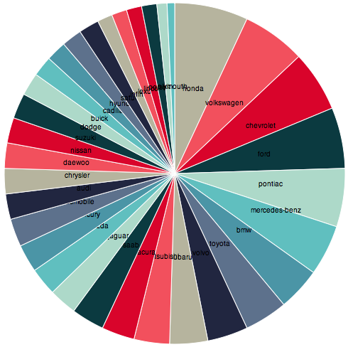

# Map Reduce dla kolekcji car_market

## Przykładowe dane
```json
{
  "make" : "bmw",
  "model" : "328ci",
  "price" : 34560,
  "wheel_base" : 107.3,
  "length" : 176.7,
  "width" : 68.5,
  "height" : 54.6,
  "curb_weight" : 3197,
  "horse_power" : 193,
  "rpm" : 5500,
  "transmission" : "manual",
  "mpg_city" : 21,
  "mpg_highway" : 29
}
```

## 1\. Ilość modeli każdej z marek

### Funkcja map

Tworzy obiekt składający się z marki i modelu

```js
var map = function() {
    emit(this.make, this.model);
};
```
### Funkcja reduce

Zlicza modele każdej marki

```js
var reduce = function(key, values) {
	var count = 0;
		for(i in values) {
			count++;        
		}
    return count;
}
```
### Wywołanie

Komenda

```js
db.cars.mapReduce(map, reduce, {out: "models_count"});
```
Wynik
```json
{
	"result" : "models_count",
	"timeMillis" : 686,
	"counts" : {
		"input" : 416,
		"emit" : 416,
		"reduce" : 33,
		"output" : 33
	},
	"ok" : 1,
}
```

### Wypisanie wyniku

Wypisuje zredukowane dane, posortowane według zliczonej ilości modeli

Komenda

```js
db.models_count.find().sort({'value': -1}) 
```
Wynik

```json
{ "_id" : "honda", "value" : 29 }
{ "_id" : "volkswagen", "value" : 25 }
{ "_id" : "chevrolet", "value" : 24 }
{ "_id" : "ford", "value" : 24 }
{ "_id" : "pontiac", "value" : 23 }
{ "_id" : "mercedes-benz", "value" : 20 }
{ "_id" : "bmw", "value" : 17 }
{ "_id" : "toyota", "value" : 17 }
{ "_id" : "volvo", "value" : 16 }
{ "_id" : "subaru", "value" : 15 }
{ "_id" : "mitsubishi", "value" : 14 }
{ "_id" : "acura", "value" : 13 }
{ "_id" : "saab", "value" : 13 }
{ "_id" : "jaguar", "value" : 11 }
{ "_id" : "mazda", "value" : 11 }
{ "_id" : "mercury", "value" : 11 }
{ "_id" : "oldsmobile", "value" : 11 }
{ "_id" : "audi", "value" : 10 }
{ "_id" : "chrysler", "value" : 10 }
{ "_id" : "daewoo", "value" : 10 }
{ "_id" : "nissan", "value" : 10 }
{ "_id" : "suzuki", "value" : 10 }
{ "_id" : "dodge", "value" : 9 }
{ "_id" : "buick", "value" : 8 }
{ "_id" : "cadillac", "value" : 8 }
{ "_id" : "hyundai", "value" : 8 }
{ "_id" : "saturn", "value" : 8 }
{ "_id" : "infiniti", "value" : 6 }
{ "_id" : "lexus", "value" : 6 }
{ "_id" : "lincoln", "value" : 6 }
{ "_id" : "porsche", "value" : 6 }
{ "_id" : "kia", "value" : 4 }
{ "_id" : "plymouth", "value" : 3 }
```

Wykres udziału poszczególnych marek w rynku



Wykres został stworzony przy pomocy d3.js. 
