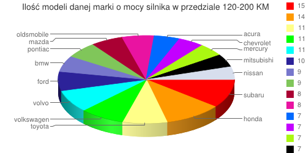
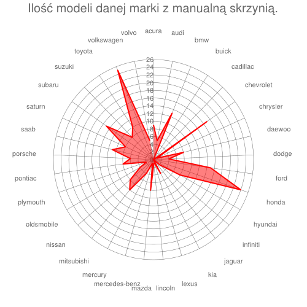
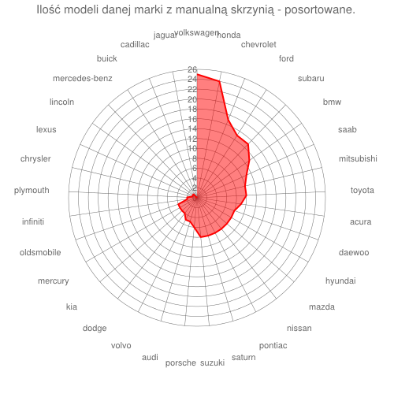

# Map Reduce 

### *Marcin Gigołło*

1\. Zliczanie ilości modeli danej marki na podstawie mocy silnika z przedziału 120-200 koni mechanicznych.

Przykładowe dane:

```js
{
	make : "acura"
	model : "3.2tl"
	price : 28855
	wheel_base : 108.1
	length : 192.9
	width : 70.3
	height : 55.7
	curb_weight : 3483
	horse_power : 225
	rpm : 5500
	transmission : "automatic"
	mpg_city : 19
	mpg_highway : 29
}

```
Funkcja Map:

```js
var m = function() {
    emit(this.make, this.horse_power);
};
```

Funkcja Reduce:

```js
var r = function(key, values) {
var count = 0;
    for(i in values) {
        if(values[i] > 120 && values[i] < 200) {
            count++;
        }
    }
    return count;
}
```

Wynik funkcji zapisuję do kolekcji power:

```js
db.samochody.mapReduce(m, r, {out: "power"});
```

Otrzymuję:
```js
{
	"result" : "power",
	"timeMillis" : 62,
	"counts" : {
		"input" : 416,
		"emit" : 416,
		"reduce" : 33,
		"output" : 33
	},
	"ok" : 1,
}
```
Pobieram dane z kolekcji power sortując je w kolejności malejącej z limitem równym 15.

```js
db.power.find().sort({'value': -1}).limit(15)
```

Wyniki:

```js
{ "_id" : "subaru", "value" : 15 }
{ "_id" : "honda", "value" : 14 }
{ "_id" : "toyota", "value" : 11 }
{ "_id" : "volkswagen", "value" : 11 }
{ "_id" : "volvo", "value" : 11 }
{ "_id" : "ford", "value" : 10 }
{ "_id" : "bmw", "value" : 9 }
{ "_id" : "pontiac", "value" : 9 }
{ "_id" : "mazda", "value" : 8 }
{ "_id" : "oldsmobile", "value" : 8 }
{ "_id" : "acura", "value" : 7 }
{ "_id" : "chevrolet", "value" : 7 }
{ "_id" : "mercury", "value" : 7 }
{ "_id" : "mitsubishi", "value" : 7 }
{ "_id" : "nissan", "value" : 7 }
```

Graficzna reprezentacja danych:



2\. Zliczanie ilości modeli danej marki z manualną skrzynią biegów.


Funkcja Map:

```js
var m = function() {
    emit(this.make, this.transmission);
};

```

Funkcja Reduce:

```js
var r = function(key, values) {
    var count = 0;
    for(i in values) {
        if(values[i] == "manual") {
            count++;
        }
    }
    return count;
}
```
Wynik funkcji zapisuję do kolekcji power:

```js
db.samochody.mapReduce(m, r, {out: "transmission"});
```
Otrzymuję:

```js
{
	"result" : "transmission",
	"timeMillis" : 99,
	"counts" : {
		"input" : 416,
		"emit" : 416,
		"reduce" : 33,
		"output" : 33
	},
	"ok" : 1,
}
```

Pobieram dane z kolekcji transmission:

```js
db.transmission.find()
```
Wyniki:
```js
{ "_id" : "acura", "value" : 9 }
{ "_id" : "audi", "value" : 5 }
{ "_id" : "bmw", "value" : 13 }
{ "_id" : "buick", "value" : 0 }
{ "_id" : "cadillac", "value" : 0 }
{ "_id" : "chevrolet", "value" : 17 }
{ "_id" : "chrysler", "value" : 1 }
{ "_id" : "daewoo", "value" : 8 }
{ "_id" : "dodge", "value" : 4 }
{ "_id" : "ford", "value" : 15 }
{ "_id" : "honda", "value" : 24 }
{ "_id" : "hyundai", "value" : 8 }
{ "_id" : "infiniti", "value" : 2 }
{ "_id" : "jaguar", "value" : 0 }
{ "_id" : "kia", "value" : 4 }
{ "_id" : "lexus", "value" : 1 }
{ "_id" : "lincoln", "value" : 1 }
{ "_id" : "mazda", "value" : 8 }
{ "_id" : "mercedes-benz", "value" : 1 }
{ "_id" : "mercury", "value" : 4 }
{ "_id" : "mitsubishi", "value" : 10 }
{ "_id" : "nissan", "value" : 8 }
{ "_id" : "oldsmobile", "value" : 4 }
{ "_id" : "plymouth", "value" : 2 }
{ "_id" : "pontiac", "value" : 8 }
{ "_id" : "porsche", "value" : 6 }
{ "_id" : "saab", "value" : 11 }
{ "_id" : "saturn", "value" : 8 }
{ "_id" : "subaru", "value" : 15 }
{ "_id" : "suzuki", "value" : 8 }
{ "_id" : "toyota", "value" : 10 }
{ "_id" : "volkswagen", "value" : 25 }
{ "_id" : "volvo", "value" : 5 }
```
Graficzna reprezentacja danych:



W celu wykonania bardziej przejrzystego wykresu dane z kolecji sortuję malejąco:

```js
db.transmission.find().sort({'value': -1})
```
Wynik:

```js
{ "_id" : "volkswagen", "value" : 25 }
{ "_id" : "honda", "value" : 24 }
{ "_id" : "chevrolet", "value" : 17 }
{ "_id" : "ford", "value" : 15 }
{ "_id" : "subaru", "value" : 15 }
{ "_id" : "bmw", "value" : 13 }
{ "_id" : "saab", "value" : 11 }
{ "_id" : "mitsubishi", "value" : 10 }
{ "_id" : "toyota", "value" : 10 }
{ "_id" : "acura", "value" : 9 }
{ "_id" : "daewoo", "value" : 8 }
{ "_id" : "hyundai", "value" : 8 }
{ "_id" : "mazda", "value" : 8 }
{ "_id" : "nissan", "value" : 8 }
{ "_id" : "pontiac", "value" : 8 }
{ "_id" : "saturn", "value" : 8 }
{ "_id" : "suzuki", "value" : 8 }
{ "_id" : "porsche", "value" : 6 }
{ "_id" : "audi", "value" : 5 }
{ "_id" : "volvo", "value" : 5 }
{ "_id" : "dodge", "value" : 4 }
{ "_id" : "kia", "value" : 4 }
{ "_id" : "mercury", "value" : 4 }
{ "_id" : "oldsmobile", "value" : 4 }
{ "_id" : "infiniti", "value" : 2 }
{ "_id" : "plymouth", "value" : 2 }
{ "_id" : "chrysler", "value" : 1 }
{ "_id" : "lexus", "value" : 1 }
{ "_id" : "lincoln", "value" : 1 }
{ "_id" : "mercedes-benz", "value" : 1 }
{ "_id" : "buick", "value" : 0 }
{ "_id" : "cadillac", "value" : 0 }
{ "_id" : "jaguar", "value" : 0 }
```

Graficzna reprezentacja danych:



Wykres jest bardziej czytelny. 

Link do skryptu: [mapReduce_6i6ant.js](../scripts/mapReduce_6i6ant.js)
