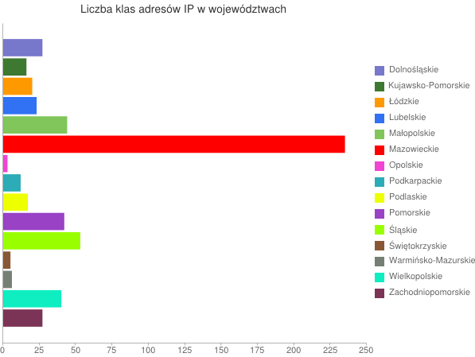
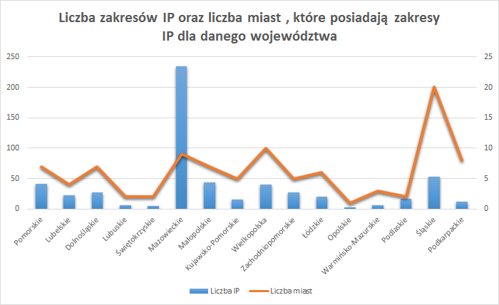

# Map Reduce Adresów IP

### *Aneta Budner*

Dla każdego województwa wyliczam liczbę klas adresów IP.

## Funkcja map

```js
var map = function() {
		emit(this.regionName, 1);
};
```

## Funkcja reduce

```js
var reduce = function(key, val) {
		var count = 0;
		for(i=0;i<val.length; i++) {
			count += val[i];
		}
		return count;
};
```

## Map Reduce na kolekcji adresyip

```js
db.adresyip.mapReduce(
	map,
	reduce,
	{ out : "result" }
);
```

## Wyniki map-reduce

```json
{ "_id" : "-", "value" : 14 }
{ "_id" : "DOLNOSLASKIE", "value" : 27 }
{ "_id" : "KUJAWSKO-POMORSKIE", "value" : 16 }
{ "_id" : "LODZKIE", "value" : 20 }
{ "_id" : "LUBELSKIE", "value" : 23 }
{ "_id" : "LUBUSKIE", "value" : 6 }
{ "_id" : "MALOPOLSKIE", "value" : 44 }
{ "_id" : "MAZOWIECKIE", "value" : 235 }
{ "_id" : "OPOLSKIE", "value" : 3 }
{ "_id" : "OVERIJSSEL", "value" : 1 }
{ "_id" : "PODKARPACKIE", "value" : 12 }
{ "_id" : "PODLASKIE", "value" : 17 }
{ "_id" : "POMORSKIE", "value" : 42 }
{ "_id" : "SLASKIE", "value" : 53 }
{ "_id" : "SWIETOKRZYSKIE", "value" : 5 }
{ "_id" : "WARMINSKO-MAZURSKIE", "value" : 6 }
{ "_id" : "WIELKOPOLSKIE", "value" : 40 }
{ "_id" : "ZACHODNIOPOMORSKIE", "value" : 27 } 
```

## Wykres



```
//chart.googleapis.com/chart
   ?chxr=0,0,250
   &chxt=x
   &chbh=a
   &chs=600x450
   &cht=bhg
   &chco=7777CC,3D7930,FF9900,3072F3,80C65A,FF0000,F044D3,2CACB7,EEFF00,9942C5,99FF00,895735,757F74,0EEEC1,7B3456
   &chds=0,250,0,250,0,250,0,250,0,250,0,250,0,250,0,250,0,250,0,250,0,250,0,250,0,250,0,250,0,250
   &chd=t:27|16|20|23|44|235|3|12|17|42|53|5|6|40|27
   &chdl=Dolnośląskie|Kujawsko-Pomorskie|Łódzkie|Lubelskie|Małopolskie|Mazowieckie|Opolskie|Podkarpackie|Podlaskie|Pomorskie|Śląskie|Świętokrzyskie|Warmińsko-Mazurskie|Wielkopolskie|Zachodniopomorskie
   &chtt=Liczba+klas+adresów+IP+w+województwach
```

Powyższy link do wykresu został wygenerowany na stronie https://developers.google.com/chart/image/ użyłam w tym przypadku BarChart.

Link posiada wszystkie informacje dotyczące mojego wykresu :

```
	chxr - zakres osi
	chbh - szerokość i rozstaw słupków
	chs - rozmiar wykresu
	cht - typ wykresu
	chco - seria kolorów
	chds - skala dla formatowania tekstu
	chd - dane wykresu
	chdl - legenda wykresu
	chtt - tytuł wykresu
```	

Dla każdego województwa wyliczam liczbę zakresów IP oraz liczbę miast , które posiadają dany zakres IP.

## Funkcja map

```js
var map = function() {
			emit(this.regionName, {miasto: [this.cityName]});
};
```

## Funkcja reduce

```js
var reduce = function(key, value) {
			var ret = { miasto: [] };
			value.forEach(function(value) {
			ret.miasto = value.miasto.concat(ret.miasto);
		});
		return ret;
};
```

## Funkcja finalize zlicza liczbę zakresów IP oraz liczbę unikalnych miast dla każdego województwa

```js
var finalize = function(key, ret) {
		var liczbaIP = 0, liczbaMiast = 0, unikalneMiasta = {};
			ret.miasto.forEach(function(value) {
			liczbaIP++;
				if(!unikalneMiasta[value]) {
					unikalneMiasta[value] = value;
					liczbaMiast++;
				}
			});
		ret.liczbaMiast = liczbaMiast;
		ret.liczbaIP = liczbaIP;
		delete ret.miasto;
		return ret;
};
```

## Map Reduce na kolekcji adresyip

```js
db.adresyip.mapReduce(
			map,
			reduce,
			{
				out : "result",
				finalize:finalize
			}
);
```

## Wyniki map-reduce

```json
{ "_id" : "-", "value" : { "liczbaMiast" : 1, "liczbaIP" : 14 } }
{ "_id" : "DOLNOSLASKIE", "value" : { "liczbaMiast" : 7, "liczbaIP" : 27 } }
{ "_id" : "KUJAWSKO-POMORSKIE", "value" : { "liczbaMiast" : 5, "liczbaIP" : 16 }}
{ "_id" : "LODZKIE", "value" : { "liczbaMiast" : 6, "liczbaIP" : 20 } }
{ "_id" : "LUBELSKIE", "value" : { "liczbaMiast" : 4, "liczbaIP" : 23 } }
{ "_id" : "LUBUSKIE", "value" : { "liczbaMiast" : 2, "liczbaIP" : 6 } }
{ "_id" : "MALOPOLSKIE", "value" : { "liczbaMiast" : 7, "liczbaIP" : 44 } }
{ "_id" : "MAZOWIECKIE", "value" : { "liczbaMiast" : 9, "liczbaIP" : 235 } }
{ "_id" : "OPOLSKIE", "value" : { "liczbaMiast" : 1, "liczbaIP" : 3 } }
{ "_id" : "OVERIJSSEL", "value" : { "liczbaMiast" : 1, "liczbaIP" : 1 } }
{ "_id" : "PODKARPACKIE", "value" : { "liczbaMiast" : 8, "liczbaIP" : 12 } }
{ "_id" : "PODLASKIE", "value" : { "liczbaMiast" : 2, "liczbaIP" : 17 } }
{ "_id" : "POMORSKIE", "value" : { "liczbaMiast" : 7, "liczbaIP" : 42 } }
{ "_id" : "SLASKIE", "value" : { "liczbaMiast" : 20, "liczbaIP" : 53 } }
{ "_id" : "SWIETOKRZYSKIE", "value" : { "liczbaMiast" : 2, "liczbaIP" : 5 } }
{ "_id" : "WARMINSKO-MAZURSKIE", "value" : { "liczbaMiast" : 3, "liczbaIP" : 6 }}
{ "_id" : "WIELKOPOLSKIE", "value" : { "liczbaMiast" : 10, "liczbaIP" : 40 } }
{ "_id" : "ZACHODNIOPOMORSKIE", "value" : { "liczbaMiast" : 5, "liczbaIP" : 27 }}
```

## Wykres



Wykres został stworzony w Excelu.


## Skrypt
* [Skrypt](/scripts/mapreduce_abudner.js)