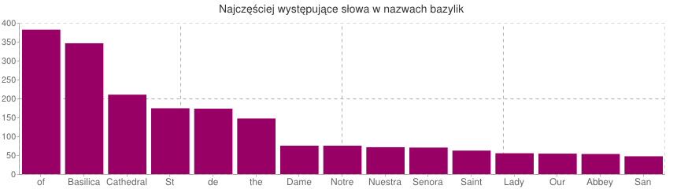
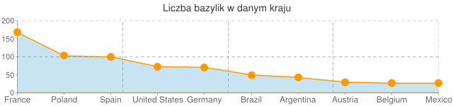

# Map Reduce na liście bazylik

### *Alicja Kopczyńska*

1\. Za pomocą poniższych funkcji generowana jest lista 15-tu najczęsciej powtarzających się słów w nazwach bazylik.

Przykładowe dane:

```json
{
	"continent" : "Asia",
	"country" : "China",
	"city" : "Shanghai",
	"basilica" : "She Shan Basilica",
	"year_of_designation" : "1942"
}
{
	"continent" : "Asia",
	"country" : "India",
	"city" : "Ranchi",
	"basilica" : "Basilica of the Divine Motherhood of Our Lady",
	"year_of_designation" : "2004"
}

```

Funkcja Map:

```js
var map = function(){
    this.basilica.match(/[A-Z]?[a-z]+/g).forEach(function(z){
	emit(z , 1);
        }
   );
};
```

Funkcja Reduce:

```js
var reduce = function(key , values){
   var total = 0;
    for (var i=0; i<values.length; i++){
       total += values[i];
	}
   return total;
};
```

Wynik funkcji map oraz reduce zapisuję do kolekcji myoutput:

```js
db.bazyliki.mapReduce(map, reduce, { out :'myoutput' });
```

Otrzymując:
```json
{
	"result" : "myoutput",
	"timeMillis" : 161,
	"counts" : {
		"input" : 1009,
		"emit" : 4129,
		"reduce" : 240,
		"output" : 966
	},
	"ok" : 1,
}
```

W ostatnim kroku pobieram dane z kolekcji myoutput sortując je w kolejności malejącej.

```js
db.myoutput.find().sort({'value': -1}).limit(15)
```

Dane wynikowe:

```json
{ "_id" : "of", "value" : 382 }
{ "_id" : "Basilica", "value" : 346 }
{ "_id" : "Cathedral", "value" : 210 }
{ "_id" : "St", "value" : 174 }
{ "_id" : "de", "value" : 173 }
{ "_id" : "the", "value" : 147 }
{ "_id" : "Dame", "value" : 75 }
{ "_id" : "Notre", "value" : 75 }
{ "_id" : "Nuestra", "value" : 71 }
{ "_id" : "Senora", "value" : 70 }
{ "_id" : "Saint", "value" : 62 }
{ "_id" : "Lady", "value" : 55 }
{ "_id" : "Our", "value" : 54 }
{ "_id" : "Abbey", "value" : 53 }
{ "_id" : "San", "value" : 47 }

```

Graficzna reprezentacja danych:



2\. Za pomocą funkcji map oraz reduce generowana jest lista 10-ciu krajów z największą liczbą bazylik.

Funkcja Map:

```js
var map = function() {
	emit(this.country, 1);
}
```

Funkcja Reduce:

```js
var reduce = function(key , values){
   var total = 0;
    for (var i=0; i<values.length; i++){
       total += values[i];
	}
   return total;
};
```
Wynik funkcji map oraz reduce zapisuję do kolekcji mycountry:

```js
db.bazyliki.mapReduce(map, reduce, { out :'mycountry' });
```

Otrzymując:
```json
{
	"result" : "mycountry",
	"timeMillis" : 1416,
	"counts" : {
		"input" : 1009,
		"emit" : 1009,
		"reduce" : 52,
		"output" : 74
	},
	"ok" : 1,
}
```

W ostatnim kroku pobieram dane z kolekcji mycountry sortując je w kolejności malejącej.

```js
db.mycountry.find().sort({'value': -1}).limit(10)
```

Dane wynikowe:

```json
{ "_id" : "France", "value" : 168 }
{ "_id" : "Poland", "value" : 103 }
{ "_id" : "Spain", "value" : 100 }
{ "_id" : "United States", "value" : 73 }
{ "_id" : "Germany", "value" : 71 }
{ "_id" : "Brazil", "value" : 50 }
{ "_id" : "Argentina", "value" : 43 }
{ "_id" : "Austria", "value" : 30 }
{ "_id" : "Belgium", "value" : 27 }
{ "_id" : "Mexico", "value" : 27 }

```
Graficzna reprezentacja danych:



Link do skryptu: [mapReduce_akopczynska.js](../scripts/mapReduce_akopczynska.js)
