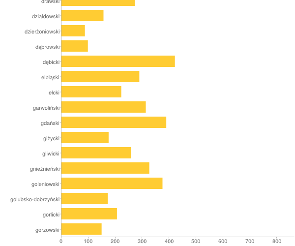
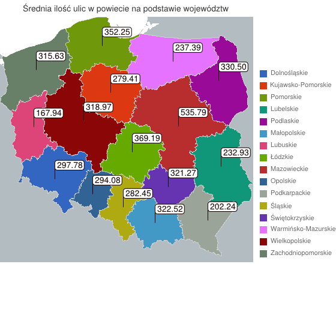

# Kody pocztowe

### *Adam Radomski*

#Ilość kodów pocztowych w powiatach

### Funkcja map:

```javascript
var map = function() {
    emit({powiat: this.powiat}, { count: 1 });
};
```


### Funkcja Reduce:

```javascript
var reduce = function (key, values) {
    var count = 0;
    values.forEach(function (v) {
        count += v['count'];
    });
    return {count: count};
};
```

### Uruchamianie 

```
db.kody_pocztowe.mapReduce(map,reduce,{ out : 'powiaty'})
```

###	Fragment wyniku

```
{ "_id" : { "powiat" : "aleksandrowski" }, "value" : { "count" : 162 } }
{ "_id" : { "powiat" : "augustowski" }, "value" : { "count" : 256 } }
{ "_id" : { "powiat" : "bartoszycki" }, "value" : { "count" : 274 } }
{ "_id" : { "powiat" : "bełchatowski" }, "value" : { "count" : 337 } }
{ "_id" : { "powiat" : "bialski" }, "value" : { "count" : 424 } }
{ "_id" : { "powiat" : "białobrzeski" }, "value" : { "count" : 185 } }
{ "_id" : { "powiat" : "białogardzki" }, "value" : { "count" : 137 } }
{ "_id" : { "powiat" : "białostocki" }, "value" : { "count" : 865 } }
{ "_id" : { "powiat" : "bielski" }, "value" : { "count" : 749 } }
{ "_id" : { "powiat" : "bieruńsko-lędziński" }, "value" : { "count" : 175 } }
{ "_id" : { "powiat" : "bieszczadzki" }, "value" : { "count" : 86 } }
{ "_id" : { "powiat" : "biłgorajski" }, "value" : { "count" : 242 } }
{ "_id" : { "powiat" : "bocheński" }, "value" : { "count" : 171 } }
{ "_id" : { "powiat" : "bolesławiecki" }, "value" : { "count" : 107 } }
{ "_id" : { "powiat" : "braniewski" }, "value" : { "count" : 328 } }
{ "_id" : { "powiat" : "brodnicki" }, "value" : { "count" : 288 } }
{ "_id" : { "powiat" : "brzeski" }, "value" : { "count" : 500 } }
{ "_id" : { "powiat" : "brzeziński" }, "value" : { "count" : 131 } }
{ "_id" : { "powiat" : "brzozowski" }, "value" : { "count" : 229 } }
{ "_id" : { "powiat" : "buski" }, "value" : { "count" : 243 } }

```

### Fragment wykresu




### [Plik JS z komendami](/scripts/mapReduce_aradomski.js)


#Ilość ulic w województwie

### Funkcja map:

```javascript
var map = function() {
    emit(this.wojewodztwo,{ulice: [this.ulica]});
};
```


### Funkcja Reduce:

```javascript
var reduce = function(key, val) {
    var res = {ulice:[]};
    val.forEach(function (value) {
        res.ulice = value.ulice.concat(res.ulice);
    });
    return res;
};
```
### Funkcja finalize 
```javascript
var finalize = function(key, res) {
	return res.ulice.length	;
};
```

### Uruchamianie 

```
db.kody_pocztowe.mapReduce(map,reduce,{ out : { inline : true },finalize:finalize })
```

###	Fragment wyniku

```
		{
			"_id" : "warmińsko-mazurskie",
			"value" : 5460
		},
		{
			"_id" : "wielkopolskie",
			"value" : 12440
		},
		{
			"_id" : "zachodniopomorskie",
			"value" : 7575
		},
		{
			"_id" : "łódzkie",
			"value" : 9968
		},
		{
			"_id" : "śląskie",
			"value" : 15535
		},
		{
			"_id" : "świętokrzyskie",
			"value" : 4819
		}


```

### Wykres
Link:
```
http://chart.googleapis.com/chart?chs=560x520&cht=map:auto=0,0,0,10&chco=B3BCC0|3366CC|DC3912|FF9900|109618|990099|0099C6|DD4477|66AA00|B82E2E|316395|994499|AAAA11|6633CC|E67300|8B0707|651067&chld=PL-DS|PL-KP|PL-PM|PL-LU|PL-PD|PL-MA|PL-LB|PL-LD|PL-MZ|PL-OP|PL-PK|PL-SL|PL-SK|PL-WN|PL-WP|PL-ZP&chdl=Dolnośląskie|Kujawsko-Pomorskie|Pomorskie|Lubelskie|Podlaskie|Małopolskie|Lubuskie|Łódzkie|Mazowieckie|Opolskie|Podkarpackie|Śląskie|Świętokrzyskie|Warmińsko-Mazurskie|Wielkopolskie|Zachodniopomorskie&chm=f7544,110000,0,1,14|f9529,110000,0,0,14|f8454,110000,0,2,14|f6522,110000,0,3,14|f6610,110000,0,4,14|f8063,110000,0,5,14|f2687,110000,0,6,14|f9968,110000,0,7,14|f25182,110000,0,8,14|f3823,110000,0,9,14|f5865,110000,0,10,14|f15535,110000,0,11,14|f4819,110000,0,12,14|f5460,110000,0,13,14|f12440,110000,0,14,14|f7575,110000,0,15,14&chtt=Liczba+ulic+w+województwach
```


### [Plik JS z komendami](/scripts/mapReduce_aradomski.js)


#Średnia ilość ulic w powiecie

### Funkcja map:

```javascript
var map = function() {
	emit(this.wojewodztwo,{ulice: [this.ulice], powiaty: [this.powiat]});
};
```


### Funkcja Reduce:

```javascript
var reduce = function(key, val) {
	var res = {ulice:[], powiaty:[]};
	val.forEach(function (value) {
		res.ulice = value.ulice.concat(res.ulice);
		res.powiaty = value.powiaty.concat(res.powiaty);
	});
	return res;
};
```
### Funkcja finalize 
```javascript
var finalize = function(key, res) {
	var countUlice = res.ulice.length, countPowiaty = 0, uniq = {};
	res.powiaty.forEach(function (value) {
		if(!uniq[value]) {
			uniq[value] = value;
			countPowiaty++;
		}
	});
	res.srednia = Number(countUlice / countPowiaty).toFixed(2);
    delete res.powiaty;
    delete res.ulice;
    return res;
};
```

### Uruchamianie 

```
db.kody_pocztowe.mapReduce(map,reduce,{ out : { inline : true },finalize:finalize })
```

###	Fragment wyniku

```
		{
			"_id" : "zachodniopomorskie",
			"value" : {
				"srednia" : "315.63"
			}
		},
		{
			"_id" : "łódzkie",
			"value" : {
				"srednia" : "369.19"
			}
		},
		{
			"_id" : "śląskie",
			"value" : {
				"srednia" : "282.45"
			}
		},
		{
			"_id" : "świętokrzyskie",
			"value" : {
				"srednia" : "321.27"
			}
		}

```

### Wykres
Link:
```
http://chart.googleapis.com/chart?chs=560x520&cht=map:auto=0,0,0,10&chco=B3BCC0|3366C1|DC3912|6F990B|109678|990A99|4399C6|DD4477|66AA00|B82E2E|316395|9AA499|AFAA11|6633B1|E673FF|8B0707|678067&chld=PL-DS|PL-KP|PL-PM|PL-LU|PL-PD|PL-MA|PL-LB|PL-LD|PL-MZ|PL-OP|PL-PK|PL-SL|PL-SK|PL-WN|PL-WP|PL-ZP&chdl=Dolnośląskie|Kujawsko-Pomorskie|Pomorskie|Lubelskie|Podlaskie|Małopolskie|Lubuskie|Łódzkie|Mazowieckie|Opolskie|Podkarpackie|Śląskie|Świętokrzyskie|Warmińsko-Mazurskie|Wielkopolskie|Zachodniopomorskie&chm=f279.41,110000,0,1,14|f297.78,110000,0,0,14|f352.25,110000,0,2,14|f232.93,110000,0,3,14|f330.50,110000,0,4,14|f322.52,110000,0,5,14|f167.94,110000,0,6,14|f369.19,110000,0,7,14|f535.79,110000,0,8,14|f294.08,110000,0,9,14|f202.24,110000,0,10,14|f282.45,110000,0,11,14|f321.27,110000,0,12,14|f237.39,110000,0,13,14|f318.97,110000,0,14,14|f315.63,110000,0,15,14&chtt=Liczba+ulic+w+województwach
```



### [Plik JS z komendami](/scripts/mapReduce_aradomski.js)


