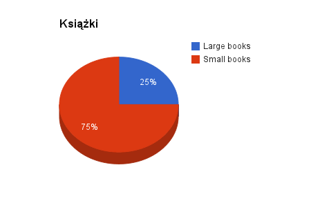

### *Daniel Landowski*
-----
Dane znajdują się w pliku [books.json](/data/dlandows/books.json)

Import do bazy:
```
mongoimport --drop -d test -c books books.json
```

Listowanie danych:
```js
books = db.books
books.find()
```

Funkcja map:
```json
var map = function() {
var book_category;
if ( this.pages >= 2000 ) 
  book_category = "Large books";
else 
  book_category = "Small books";
emit(book_category, {name: this.name});
};
```

Funkcja reduce:
```json
var reduce = function(key, values) {
  var sum = 0;
  values.forEach(function(doc) {
    sum += 1;
  });
  return {books: sum};
};
```

Uruchomienie obliczeń:
```json
var count  = db.books.mapReduce(map, reduce, {out: "book_results"});
db[count.result].find()
```

Rezultat:
```json
{ "_id" : "Large books", "value" : { "books" : 5 } }
{ "_id" : "Small books", "value" : { "books" : 15 } }
```



