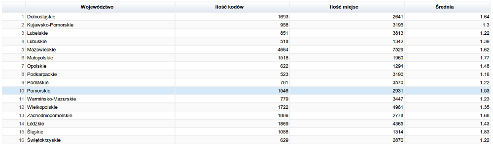

# Kody pocztowe

### *Dorian Sawa*

Użyłem tej samej kolekcji kodów pocztowych co w projekcie z aggregacjami.
MapReduce wykorzystałem do przedstawienia faktycznej liczby kodów pocztowych dla województw oraz
średniej ilości kodów na miejsce.

## Liczba kodów w województwie:

### Pierwsza funkcja map:

```javascript
var map = function () {
    emit({kod: this.kod, wojewodztwo: this.wojewodztwo}, { count: 1 });
};
```

### Funkcja Reduce:

```javascript
var reduce = function (key, values) {
    var count = 0;
    values.forEach(function (v) {
        count += v['count'];
    });
    return {count: count};
};
```

### Uruchomienie i pierwsze wyniki:
```
db.zipcodes.mapReduce(map, reduce, { out: 'kody_results'});
```

Stworzyło mi to 'pośrednią' kolekcję, gdzie dokumenty są takiej postaci:
```json
{
	"_id" : {
		"kod" : "00-001",
		"wojewodztwo" : "mazowieckie"
	},
	"value" : {
		"count" : 4
	}
}
{
	"_id" : {
		"kod" : "00-002",
		"wojewodztwo" : "mazowieckie"
	},
	"value" : {
		"count" : 1
	}
}
```

By poprawnie policzyć teraz unikalne wystąpienia kodów, potrzebna będzie kolejna funkcja mapująca.

### Druga funkcja map
```javascript
var map2 = function () {
   emit(this['_id']['wojewodztwo'], {count: 1});
};
```

### Wywołanie na kolekcji pośredniczącej i wyniki:

```
db.kody_results.mapReduce(map2, reduce, { out: 'kody_for_woj_uniq'});
```

Ostateczny wynik:
```
> db.kody_for_woj_uniq.find();
{ "_id" : "dolnośląskie", "value" : { "count" : 1693 } }
{ "_id" : "kujawsko-pomorskie", "value" : { "count" : 958 } }
{ "_id" : "lubelskie", "value" : { "count" : 851 } }
{ "_id" : "lubuskie", "value" : { "count" : 518 } }
{ "_id" : "mazowieckie", "value" : { "count" : 4664 } }
{ "_id" : "małopolskie", "value" : { "count" : 1518 } }
{ "_id" : "opolskie", "value" : { "count" : 622 } }
{ "_id" : "podkarpackie", "value" : { "count" : 523 } }
{ "_id" : "podlaskie", "value" : { "count" : 781 } }
{ "_id" : "pomorskie", "value" : { "count" : 1546 } }
{ "_id" : "warmińsko-mazurskie", "value" : { "count" : 779 } }
{ "_id" : "wielkopolskie", "value" : { "count" : 1722 } }
{ "_id" : "zachodniopomorskie", "value" : { "count" : 1886 } }
{ "_id" : "łódzkie", "value" : { "count" : 1869 } }
{ "_id" : "śląskie", "value" : { "count" : 1088 } }
{ "_id" : "świętokrzyskie", "value" : { "count" : 629 } }
```


## Średnia ilość kodów na miejsce:

### Funkcja map:

```javascript
var mapFunction = function () {
  emit(this.wojewodztwo, {kody: this.kod, miejsca: this.miejsce});
};
```

### Funkcja Reduce - używa dopisanych funkcji spłaszczającej tablice oraz usuwającej powtarzające się wartości w tablicy:

```javascript
var reduceFunction = function (key, values) {
  Array.prototype.flatten = function flatten() {
    var flat = [];
    for (var i = 0, l = this.length; i < l; i++) {
      var type = Object.prototype.toString.call(this[i]).split(' ').pop().split(']').shift().toLowerCase();
      if (type) {
        flat = flat.concat(/^(array|collection|arguments|object)$/.test(type) ?
          flatten.call(this[i]) : this[i]);
      }
    }
    return flat;
  };

  Array.prototype.unique = function () {
    var uniq = {}, array = [];
    for (var i = 0, l = this.length; i < l; ++i) {
      if (uniq.hasOwnProperty(this[i])) {
        continue;
      }
      array.push(this[i]);
      uniq[this[i]] = 1;
    }
    return array;
  };

  var res = {}, kody = [], miejsca = [];

  values.forEach(function (v) {
    kody.push(v.kody);
    miejsca.push(v.miejsca);
  });

  res.kody = kody.flatten().unique();
  res.miejsca = miejsca.flatten().unique();
  return res;
};
```

### Pożądane wyniki wyświetlam z pomocą funkcji finalize:
```javascript
var finalizeFunction = function (key, res) {
  res.iloscKodow = res.kody.length;
  res.iloscMiejsc = res.miejsca.length;
  res.srednia = Number((res.iloscKodow + res.iloscMiejsc) / res.iloscMiejsc).toFixed(2);

  delete res.kody;
  delete res.miejsca;
  return res;
};
```

### Wywołanie oraz wyniki:
```
> db.zipcodes.mapReduce(mapFunction, reduceFunction, { finalize: finalizeFunction, out: 'results'});
```

```
> db.results.find();
{ "_id" : "dolnośląskie", "value" : { "iloscKodow" : 1693, "iloscMiejsc" : 2641, "srednia" : "1.64" } }
{ "_id" : "kujawsko-pomorskie", "value" : { "iloscKodow" : 958, "iloscMiejsc" : 3195, "srednia" : "1.30" } }
{ "_id" : "lubelskie", "value" : { "iloscKodow" : 851, "iloscMiejsc" : 3813, "srednia" : "1.22" } }
{ "_id" : "lubuskie", "value" : { "iloscKodow" : 518, "iloscMiejsc" : 1342, "srednia" : "1.39" } }
{ "_id" : "mazowieckie", "value" : { "iloscKodow" : 4664, "iloscMiejsc" : 7529, "srednia" : "1.62" } }
{ "_id" : "małopolskie", "value" : { "iloscKodow" : 1518, "iloscMiejsc" : 1960, "srednia" : "1.77" } }
{ "_id" : "opolskie", "value" : { "iloscKodow" : 622, "iloscMiejsc" : 1294, "srednia" : "1.48" } }
{ "_id" : "podkarpackie", "value" : { "iloscKodow" : 523, "iloscMiejsc" : 3190, "srednia" : "1.16" } }
{ "_id" : "podlaskie", "value" : { "iloscKodow" : 781, "iloscMiejsc" : 3570, "srednia" : "1.22" } }
{ "_id" : "pomorskie", "value" : { "iloscKodow" : 1546, "iloscMiejsc" : 2931, "srednia" : "1.53" } }
{ "_id" : "warmińsko-mazurskie", "value" : { "iloscKodow" : 779, "iloscMiejsc" : 3447, "srednia" : "1.23" } }
{ "_id" : "wielkopolskie", "value" : { "iloscKodow" : 1722, "iloscMiejsc" : 4981, "srednia" : "1.35" } }
{ "_id" : "zachodniopomorskie", "value" : { "iloscKodow" : 1886, "iloscMiejsc" : 2778, "srednia" : "1.68" } }
{ "_id" : "łódzkie", "value" : { "iloscKodow" : 1869, "iloscMiejsc" : 4365, "srednia" : "1.43" } }
{ "_id" : "śląskie", "value" : { "iloscKodow" : 1088, "iloscMiejsc" : 1314, "srednia" : "1.83" } }
{ "_id" : "świętokrzyskie", "value" : { "iloscKodow" : 629, "iloscMiejsc" : 2876, "srednia" : "1.22" } }
```

### Wyniki prezentuje tabela z Google Visualisation API:



### Plik JS z komendami
[Klik](/scripts/dsawa/mapreduce_dsawa.js)
