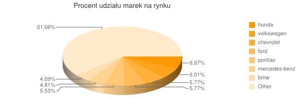
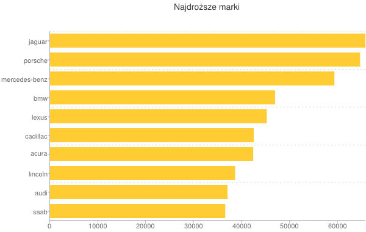

# Samochody w USA

### *Jan Pawlukiewicz*


## Procentowy udział marek na rynku

### Funkcja map:

```ruby
map = %Q{
  function() {
    emit(this.make, 1);
  };
}
```

### Funkcja Reduce:

```ruby
reduce = %Q{
  function(key, values) {
	return Array.sum(values);
  };
}
```

### Wywołanie:

```ruby
results = car_market.map_reduce(map, reduce, 
  {:out => {inline: true}, :raw => true})["results"].sort{
  |a,b| a["value"] > b["value"] ? -1 : 1}
```

Po wywyłaniu całego skryptu otrzymałem link do Google Chart:




## Najdroższe marki

### Funkcja map:

```ruby
map2 = %Q{
  function() {
    emit(this.make, this.price);
  };
}
```

### Funkcja Reduce:

```ruby
reduce2 = %Q{
  function(key, values) {
	return Array.sum(values)/values.length;
  };
}
```

### Wywołanie:

```ruby
results2 = car_market.map_reduce(map2, reduce2, 
  {:out => {inline: true}, :raw => true})["results"].sort{
  |a,b| a["value"] > b["value"] ? -1 : 1}.take(10)
```

Po wywyłaniu całego skryptu otrzymałem link do Google Chart:



### Cały skrypt
[Tutaj](../scripts/mapreduce_jpawlukiewicz.rb)
