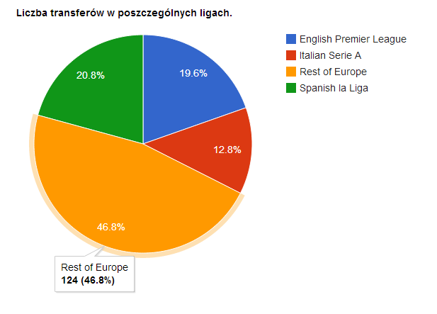
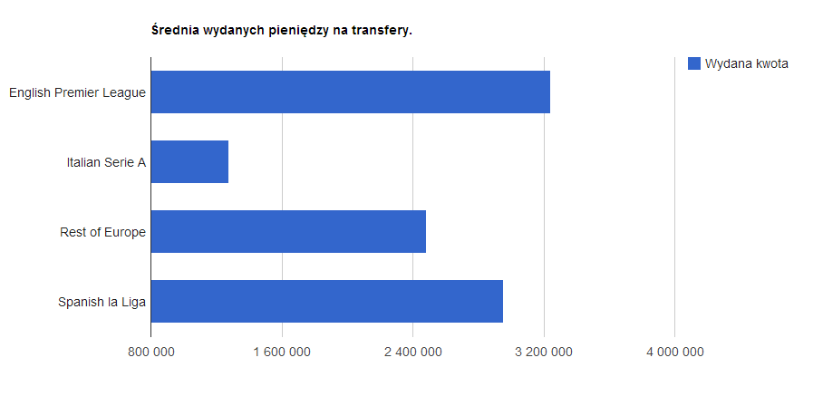

# Transfery zawodników piłki nożnej w latach 2007-2013

#### Autor: *Łukasz Kępiński*

##Źródło danych: 

http://www.soccernews.com/soccer-transfers/

## Co zrobiłem aby przygotować dane?

1. Stworzono aplikację w języku C# (.NET framework) do pobierania listy transferów w formie przystępnej dla GoogleRefine (linijka w linijkę).
1. Import plików do GoogleRefine (scalenie danych z 16 plików jednocześnie).
1. Oczyszczenie oraz segregacja danych do odpowiednich kolumn za pomocą narzędzia GoogleRefine.
1. Edycja kolumny z nazwami plików przy pomocy narzędzi GoogleRefine, tak aby zamiast kolumny z nazwą pliku utworzyć 2 kolumny - ligę oraz lata transferu (użycie 'facet', 'split column' oraz wyrażeń regularnych).
1. Ujednolicenie danych z kolumny "Price", tak aby każdy wpis z kwota byl formatu numerycznego.

### Screen z aplikacji, którą stworzyłem:


###Metoda 'wyciągająca' dane:

```java
/// <summary>
/// Get all transfers data as list of strings.
/// </summary>
/// <param name="htmlDocument">HTML document string representation.</param>
/// <returns>String list of data.</returns>
public List<String> GetTransfersData(string htmlDocument)
{
	// Data container.
	List<string> dataToSave = new List<string>();

	// Load downloaded website.
	HtmlAgilityPack.HtmlDocument htmlDoc = new HtmlAgilityPack.HtmlDocument();
	htmlDoc.LoadHtml(htmlDocument);

	// Find proper HTML element with transfers 'table'.
	HtmlAgilityPack.HtmlNode div = htmlDoc.DocumentNode.SelectSingleNode("//div[@class='panes']");

	// Get all players with data, each data element as separate list element.
	if (div != null)
	{
		dataToSave = div.Descendants("li")
					   .Select(a => a.InnerText)
					   .ToList();
	}
	else
	{
		throw new Exception("Could not find div with transfers!");
	}

	return dataToSave;
}
```

## Przykładowe rekordy:
```json
    {
      "Type" : "Italian Serie A",
      "Years" : "2012-2013",
      "Player" : "Thomas HeurtauxDefender",
      "Country" : "France",
      "To" : "Udinese",
      "From" : "Caen",
      "Price" : "2000000"
    },
    {
      "Type" : "Italian Serie A",
      "Years" : "2012-2013",
      "Player" : "Andrea LazzariMidfielder",
      "Country" : "Italy",
      "To" : "Udinese",
      "From" : "Fiorentina",
      "Price" : "Loan"
    },
	{
      "Type" : "English Premier League",
      "Years" : "2012-2013",
      "Player" : "Michael OwenAttacker",
      "Country" : "England",
      "To" : "Stoke",
      "From" : "Manchester Utd",
      "Price" : "Free"
    },
    {
      "Type" : "English Premier League",
      "Years" : "2012-2013",
      "Player" : "Brek Shea Goalkeeper",
      "Country" : "USA",
      "To" : "Stoke",
      "From" : "FC Dallas",
      "Price" : "2900000"
    }
```

#Map-Reduce:

Map-Reduce - Która liga do jakiej ilości klubów transferowała graczy oraz średnia cena transferu graczy.

Map:
```javascript
var map = function() {
        emit( this.Type, { prices: [this.Price], tos: [this.To] } );
};
```

Reduce:
```javascript
var reduce = function(key, val) {
        var res = { prices:[], tos:[] };
        val.forEach(function (value) {
                res.prices = value.prices.concat(res.prices);
                res.tos = value.tos.concat(res.tos);
        } );

        return res;
};
```

Finalize:
```javascript
var finalize = function(key, res) {

        var pricesCount = res.prices.length;
        var pricesSum = 0;
        var tosCount = 0;
        var unique = {};

        // Count overall prices sum.
        res.prices.forEach(function (value) {
                if(Number(value)) {
                        pricesSum += value;
                }
        } );

        // Count unique clubs which transfers were made to.
        res.tos.forEach(function (value) {
                if(!unique[value]){
                        unique[value] = value;
                        tosCount++;
                }
        } );

        res.tosMany = tosCount;
        res.averagePrice = Number( pricesSum / pricesCount).toFixed(2);

        delete res.prices;
        delete res.tos;

        return res;
};
```

Wywołanie:
```javascript
db.transfers.mapReduce( map, reduce, { out:"result", finalize:finalize } );
```

Wyniki:
```json
{ "_id" : "English Premier League", "value" : { "tosMany" : 52, "averagePrice" : "3239980.27" } }
{ "_id" : "Italian Serie A", "value" : { "tosMany" : 34, "averagePrice" : "1274638.73" } }
{ "_id" : "Rest of Europe", "value" : { "tosMany" : 124, "averagePrice" : "2484960.40" } }
{ "_id" : "Spanish la Liga", "value" : { "tosMany" : 55, "averagePrice" : "2953793.10" } }
```




Skrypt:
[mapReduce_lkepinsk.js](../scripts/mapReduce_lkepinsk.js)
