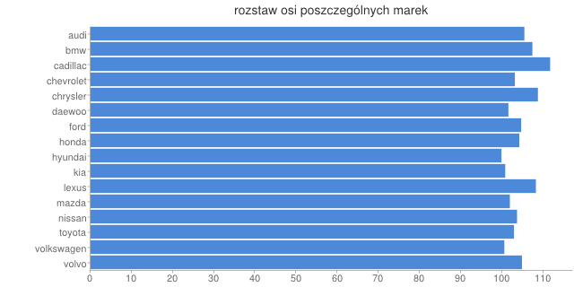
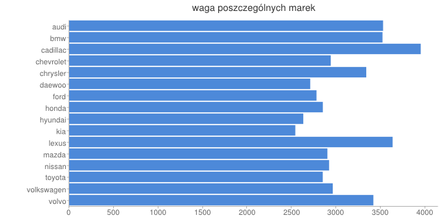

#Średni rozstaw osi i waga samochodów poszczególnych marek

### *Michał Frankowski*

##Funkcja map
```js
var map = function() {
    emit(this.make, { make: this.make, weight: this.curb_weight, base: this.wheel_base });
};
```

##Funkcja reduce
```js
var reduce = function(key, values) {
    var count = 0, i =0;
	var obj = {
        make: key,
        avgCW: 0,
        avgWB: 0
    };

    for(i in values) {
        obj.avgCW += values[i].weight;
        obj.avgWB += values[i].base;
        count ++;
    }
    obj.avgCW /= count;
    obj.avgWB /= count;

    return obj;
};
```

##Wywołanie
```js
db.cars.mapReduce(map, reduce, { out: "results" });
```

##Export wyniku do jsona
```
mongoexport --db nosql --collection results --out collection.json
```

```json
{ "_id" : "audi", "value" : 
	{ 
	"make" : "audi", 
	"avgCW" : 3527.5, 
	"avgWB" : 105.45 
	}
}
```

##Wykresy



##Pliki
[Skrypt](../scripts/mapreduce_mfrankowski.js)
[Json wyniku](../data/json/mfrankowski.json)
