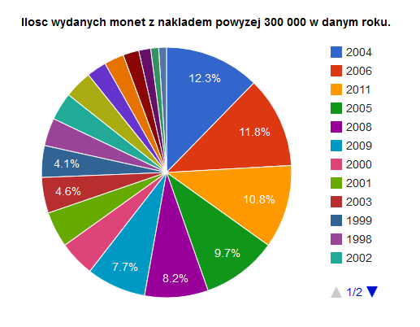

# Map Reduce Monety okolicznościowe
### *Mateusz Skorb*

Ilość wydanych monet z nakładem powyżej 300 000 w danym roku.

### Funkcja map

```js
var map = function() {
    emit(this.Rok, this.Nakład);
};
```

### Funkcja reduce

```js
var reduce = function(key, values) {
var count = 0;
    for(i in values) {
        if(values[i] >= 300000) {
            count++;
        }
    }
    return count;
}
```

### Utworzenie nowej kolekcji
```js
db.coins.mapReduce(map, reduce, {out: "naklad"});
```

### Wynik map reduce
Posortowany malejąco

```json
{ "_id" : 2004, "value" : 24 }
{ "_id" : 2006, "value" : 23 }
{ "_id" : 2011, "value" : 21 }
{ "_id" : 2005, "value" : 19 }
{ "_id" : 2008, "value" : 16 }
{ "_id" : 2009, "value" : 15 }
{ "_id" : 2000, "value" : 9 }
{ "_id" : 2001, "value" : 9 }
{ "_id" : 2003, "value" : 9 }
{ "_id" : 1999, "value" : 8 }
{ "_id" : 1998, "value" : 7 }
{ "_id" : 2002, "value" : 7 }
{ "_id" : 2012, "value" : 7 }
{ "_id" : 1995, "value" : 5 }
{ "_id" : 2007, "value" : 5 }
{ "_id" : 1997, "value" : 4 }
{ "_id" : 1996, "value" : 3 }
{ "_id" : 2010, "value" : 2 }
{ "_id" : 2013, "value" : 2 }
```



[Wersja html](http://skorb.pl/projekty/nosql/chartmr.html)


## Skrypt
* [Skrypt](/scripts/mapreduce_mskorb.js)