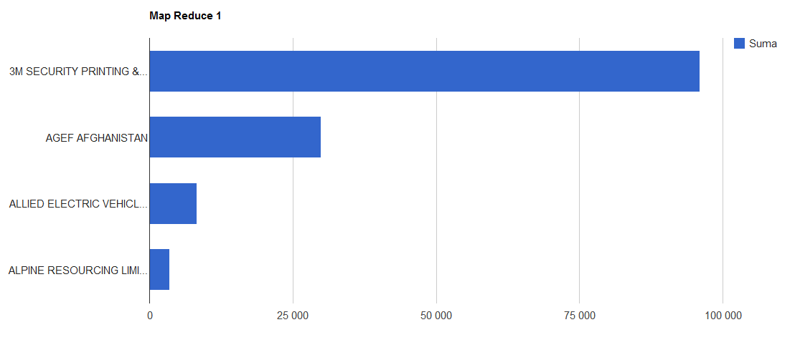
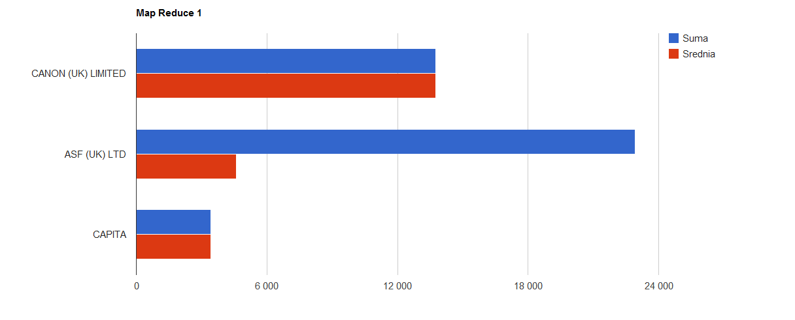
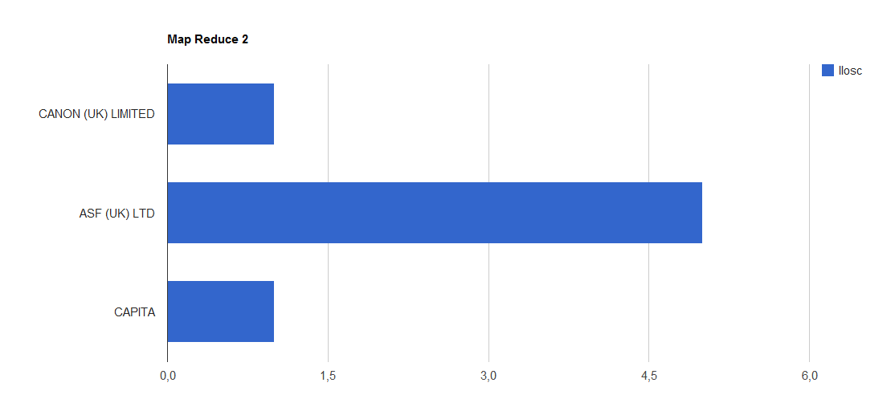
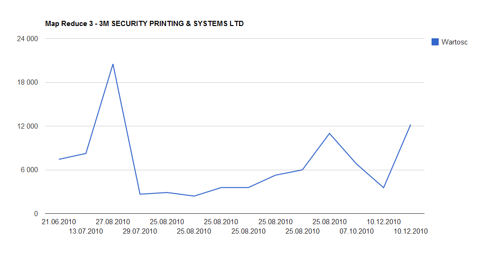

# Map Reduce dla wydatkow brytyjskiego Home Office w 2010 roku

## Format danych:

```json
{
    "_id" : ObjectId("51a3baa866d34fb869b0000b"),
    "Amount" : 3177.15,
    "Transaction code" : "",
    "File" : "refine2.csv",
    "Department family" : "Home Office",
    "Entity" : "Home Office",
    "Date" : "13.05.2010",
    "Expense type" : "Science; Technical & Research.Social Research",
    "Expense area" : "CPG - Crime & Policing Group",
    "Supplier" : "MATRIX RESEARCH AND CONSULTANCY LTD",
    "Transaction number" : 1715492
}
```
## Zadania 

## 1\. Wydatki agregowane wg. dostawcy

### Map - Reduce

```javascript
var map = function() {
    emit(this.Supplier, this.Amount);
};

var reduce = function(key, value) {
	return Array.sum(value);
};

var params = {
	out: "task_1"
};

db.nosql.mapReduce(map, reduce, params);
```

### Wynik (fragment)

```json
{ "_id" : "3M SECURITY PRINTING & SYSTEMS LTD", "value" : 96042.62 }
{ "_id" : "AGEF AFGHANISTAN", "value" : 29950 }
{ "_id" : "ALLIED ELECTRIC VEHICLES", "value" : 8247.5 }
{ "_id" : "ALPINE RESOURCING LIMITED", "value" : 3488.75 }
...
```



### 2\. Wydatki agregowane wg. dostawcy + ilosc zamowien, srednia wartosc zamowienia

### Map - Reduce

```javascript
var map = function() {
    emit(this.Supplier, {
		count: 1,
		sum: this.Amount
	});
};

var reduce = function(key, value) {
	var obj = {count: 0, sum: 0};
	for(var i=0; i<value.length; i++){
		obj.count += value[i].count;
		obj.sum += value[i].sum; 
	}
	return obj;
};

var finalize = function (key, value) {
	value.avg = value.sum/value.count;
    return value;
};

var params = {
	out: "task_2",
	finalize: finalize
};

db.nosql.mapReduce(map, reduce, params);
```

### Wynik (fragment)

```json
{ "_id" : "CANON (UK) LIMITED", "value" : { "count" : 1, "sum" : 13746.13, "avg" : 13746.13 } }
{ "_id" : "ASF (UK) LTD", "value" : { "count" : 5, "sum" : 22918.95, "avg" : 4583.79 } }
{ "_id" : "CAPITA", "value" : { "count" : 1, "sum" : 3430.67, "avg" : 3430.67 } }
...
```




### 3\. Dla kazdego dostawcy zbierz wszystkie jego zamowienia jako pary: data i wartosc 

### Map - Reduce

```javascript
var map = function() {
    emit(this.Supplier, {
		date: this.Date,
		sum: this.Amount
	});
};

var reduce = function(key, value) {
	var obj = {orders:[]};
	for(var i=0; i<value.length; i++){
		obj.orders.push( value[i] );
	}
	return obj;
};

var finalize = function (key, value) {
	if(value.orders){
		value.count = value.orders.length;
	}
    return value;
};

var params = {
	out: "task_3",
	sort: { _id: -1 },
	finalize: finalize
};

db.nosql.mapReduce(map, reduce, params);
```

### Wynik (fragment)

```json
{
        "_id" : "3M SECURITY PRINTING & SYSTEMS LTD",
        "value" : {
                "orders" : [
                        {
                                "date" : "10.12.2010",
                                "sum" : 3547.2
                        },
                        {
                                "date" : "10.12.2010",
                                "sum" : 12208
                        },
                        {
                                "date" : "07.10.2010",
                                "sum" : 6795
                        },
                        {
                                "date" : "21.06.2010",
                                "sum" : 7435
                        },
                        {
                                "date" : "29.07.2010",
                                "sum" : 2653.7
                        },
                        {
                                "date" : "13.07.2010",
                                "sum" : 8243.75
                        },
                        {
                                "date" : "27.08.2010",
                                "sum" : 20507.5
                        },
                        {
                                "date" : "25.08.2010",
                                "sum" : 2887.6
                        },
                        {
                                "date" : "25.08.2010",
                                "sum" : 2395.2
                        },
                        {
                                "date" : "25.08.2010",
                                "sum" : 3562.4
                        },
                        {
                                "date" : "25.08.2010",
                                "sum" : 3562.4
                        },
                        {
                                "date" : "25.08.2010",
                                "sum" : 5257.02
                        },
                        {
                                "date" : "25.08.2010",
                                "sum" : 5995.95
                        },
                        {
                                "date" : "25.08.2010",
                                "sum" : 10991.9
                        }
                ],
                "count" : 14
        }
}
...
```

