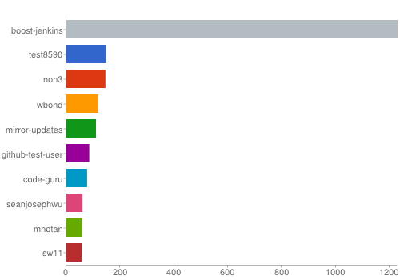

# Aktywność userów Githuba

### *Paweł Śląski*

Użyłem danych z github archive z dnia 19.05.2013 z godzin 20:00 - 24:00 (niedziela, wieczór)

Wykorzystałem je do policzenia, który user był najaktywniejszy w danym okresie.

Próba policzenia, który język był najpopularniejszy tego wieczoru była nieudana (problem z dostaniem się do zagnieżdzonego pola obiektu w mapreduce)

### Funkcja Map:

```javascript
var map = function () {
	emit({codder : this.actor}, { count: 1 });
};
```

### Funkcja Reduce:

```javascript
var reduce = function (key, values) {
    var count = 0;
    values.forEach(function (v) {
        count += v['count'];
    });
    return {count: count};
};
```

### Wyniki:
```
db.github_sunday_evening.mapReduce(map, reduce, { out: 'codder_results'});
```
Następnie wynik posortowałem według aktywności i wybrałem 10 najbardziej aktywnym userów 
Znów wystąpił problem z zagnieżdzonym polem w mapreduce (tym razem próba sortowania), więc czynności te wykonałem w shellu na kolekcji

```
db.codder_results.find().sort({"value.count" : -1}).limit(10)
```

Rezultat

```json
{ "_id" : { "codder" : "boost-jenkins" }, "value" : { "count" : 1230 } }
{ "_id" : { "codder" : "test8590" }, "value" : { "count" : 148 } }
{ "_id" : { "codder" : "non3" }, "value" : { "count" : 145 } }
{ "_id" : { "codder" : "wbond" }, "value" : { "count" : 118 } }
{ "_id" : { "codder" : "mirror-updates" }, "value" : { "count" : 110 } }
{ "_id" : { "codder" : "github-test-user" }, "value" : { "count" : 85 } }
{ "_id" : { "codder" : "code-guru" }, "value" : { "count" : 77 } }
{ "_id" : { "codder" : "seanjosephwu" }, "value" : { "count" : 60 } }
{ "_id" : { "codder" : "mhotan" }, "value" : { "count" : 59 } }
{ "_id" : { "codder" : "sw11" }, "value" : { "count" : 58 } }
```



### Plik JS z komendami
[Klik](/scripts/mapreduce_pslaski.js)
