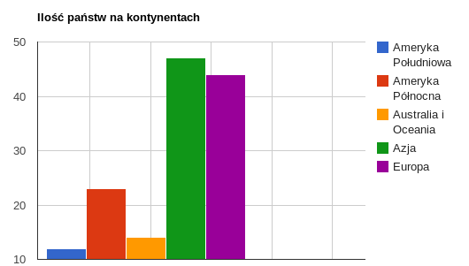

### *Romuald Łuczyk, 186499*
---

# Map reduce

### *db.panstwa

Wyliczenie ilości państw dla każdego kontynentu.

## Funkcja map

```js
var map;
map = function() {
		emit(this.kontynent, 1);
};
```

## Funkcja reduce

```js
var reduce;
reduce = function(key, val) {
		var count = 0;
		for(i = 0; i < val.length; i++) {
			count += val[i];
		}
		return count;
};
```

## Wywołanie mapReduce

```js
db.panstwa.mapReduce(
	map,
	reduce,
	{ out : "result" }
);
```

## Wyniki agregacji

```json

Wyniki znajdują się w kolekcji "result". < db.result.find() >


{ "_id" : "Afryka", "value" : 54 }
{ "_id" : "Ameryka Południowa", "value" : 12 }
{ "_id" : "Ameryka Północna", "value" : 23 }
{ "_id" : "Australia i Oceania", "value" : 14 }
{ "_id" : "Azja", "value" : 47 }
{ "_id" : "Europa", "value" : 44 }
```
Wykres:


Link do skryptu: [mapReduce_rluczyk.js](../scripts/mapReduce_rluczyk.js)
