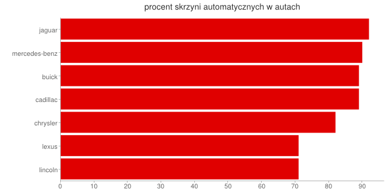

# Map Reduce - Samochody w USA
### *Wojciech Szymański*

Wyliczam procent skrzyni automatycznych w poszczególnych markach

## Funkcja map

```js
var map = function() {
  emit(this.make, { make: this.make, transmission: this.transmission });
};
```

## Funkcja reduce

```js

var reduce = function(key, vals) {
  var obj = {
    make: key,
    automatic: 0,
    non_automatic: 0
  }, i;

  for (i in vals) {
    switch (vals[i]["transmission"]) {
      case "automatic":
        obj.automatic += 1;
        break;
      default:
        obj.non_automatic += 1;
    }
  }
  obj.automatic_transmission_percent = Math.round(obj.automatic / (obj.automatic + obj.non_automatic) * 100);
  return obj;
};
```

## Map Reduce na kolekcji car_market

```js
db.car_market.mapReduce(map, reduce, {out: "transmission"});
```

## Wyniki agregacji

```json
{ "_id" : "acura", "value" : { "make" : "acura", "automatic" : 4, "non_automatic" : 10, "automatic_transmission_percent" : 29 } }
{ "_id" : "audi", "value" : { "make" : "audi", "automatic" : 5, "non_automatic" : 6, "automatic_transmission_percent" : 45 } }
{ "_id" : "bmw", "value" : { "make" : "bmw", "automatic" : 4, "non_automatic" : 14, "automatic_transmission_percent" : 22 } }
{ "_id" : "buick", "value" : { "make" : "buick", "automatic" : 8, "non_automatic" : 1, "automatic_transmission_percent" : 89 } }
{ "_id" : "cadillac", "value" : { "make" : "cadillac", "automatic" : 8, "non_automatic" : 1, "automatic_transmission_percent" : 89 } }
{ "_id" : "chevrolet", "value" : { "make" : "chevrolet", "automatic" : 7, "non_automatic" : 6, "automatic_transmission_percent" : 54 } }
{ "_id" : "chrysler", "value" : { "make" : "chrysler", "automatic" : 9, "non_automatic" : 2, "automatic_transmission_percent" : 82 } }
{ "_id" : "daewoo", "value" : { "make" : "daewoo", "automatic" : 0, "non_automatic" : 2, "automatic_transmission_percent" : 0 } }
{ "_id" : "dodge", "value" : { "make" : "dodge", "automatic" : 5, "non_automatic" : 5, "automatic_transmission_percent" : 50 } }
{ "_id" : "ford", "value" : { "make" : "ford", "automatic" : 9, "non_automatic" : 16, "automatic_transmission_percent" : 36 } }
{ "_id" : "honda", "value" : { "make" : "honda", "automatic" : 5, "non_automatic" : 25, "automatic_transmission_percent" : 17 } }
{ "_id" : "hyundai", "value" : { "make" : "hyundai", "automatic" : 0, "non_automatic" : 9, "automatic_transmission_percent" : 0 } }
{ "_id" : "infiniti", "value" : { "make" : "infiniti", "automatic" : 4, "non_automatic" : 3, "automatic_transmission_percent" : 57 } }
{ "_id" : "jaguar", "value" : { "make" : "jaguar", "automatic" : 11, "non_automatic" : 1, "automatic_transmission_percent" : 92 } }
{ "_id" : "kia", "value" : { "make" : "kia", "automatic" : 0, "non_automatic" : 5, "automatic_transmission_percent" : 0 } }
{ "_id" : "lexus", "value" : { "make" : "lexus", "automatic" : 5, "non_automatic" : 2, "automatic_transmission_percent" : 71 } }
{ "_id" : "lincoln", "value" : { "make" : "lincoln", "automatic" : 5, "non_automatic" : 2, "automatic_transmission_percent" : 71 } }
{ "_id" : "mazda", "value" : { "make" : "mazda", "automatic" : 3, "non_automatic" : 9, "automatic_transmission_percent" : 25 } }
{ "_id" : "mercedes-benz", "value" : { "make" : "mercedes-benz", "automatic" : 19, "non_automatic" : 2, "automatic_transmission_percent" : 90 } }
{ "_id" : "mercury", "value" : { "make" : "mercury", "automatic" : 7, "non_automatic" : 5, "automatic_transmission_percent" : 58 } }
{ "_id" : "mitsubishi", "value" : { "make" : "mitsubishi", "automatic" : 4, "non_automatic" : 11, "automatic_transmission_percent" : 27 } }
{ "_id" : "nissan", "value" : { "make" : "nissan", "automatic" : 2, "non_automatic" : 9, "automatic_transmission_percent" : 18 } }
{ "_id" : "oldsmobile", "value" : { "make" : "oldsmobile", "automatic" : 7, "non_automatic" : 5, "automatic_transmission_percent" : 58 } }
{ "_id" : "plymouth", "value" : { "make" : "plymouth", "automatic" : 1, "non_automatic" : 3, "automatic_transmission_percent" : 25 } }
{ "_id" : "pontiac", "value" : { "make" : "pontiac", "automatic" : 15, "non_automatic" : 9, "automatic_transmission_percent" : 63 } }
{ "_id" : "porsche", "value" : { "make" : "porsche", "automatic" : 0, "non_automatic" : 7, "automatic_transmission_percent" : 0 } }
{ "_id" : "saab", "value" : { "make" : "saab", "automatic" : 2, "non_automatic" : 12, "automatic_transmission_percent" : 14 } }
{ "_id" : "saturn", "value" : { "make" : "saturn", "automatic" : 0, "non_automatic" : 9, "automatic_transmission_percent" : 0 } }
{ "_id" : "subaru", "value" : { "make" : "subaru", "automatic" : 0, "non_automatic" : 16, "automatic_transmission_percent" : 0 } }
{ "_id" : "suzuki", "value" : { "make" : "suzuki", "automatic" : 2, "non_automatic" : 9, "automatic_transmission_percent" : 18 } }
{ "_id" : "toyota", "value" : { "make" : "toyota", "automatic" : 7, "non_automatic" : 11, "automatic_transmission_percent" : 39 } }
{ "_id" : "volkswagen", "value" : { "make" : "volkswagen", "automatic" : 0, "non_automatic" : 26, "automatic_transmission_percent" : 0 } }
{ "_id" : "volvo", "value" : { "make" : "volvo", "automatic" : 11, "non_automatic" : 6, "automatic_transmission_percent" : 65 } }
```

## Wykres wykonany przy użyciu Google Chart Tools

```
http://chart.googleapis.com/chart
  ?chxl=0:|lincoln|lexus|chrysler|cadillac|buick|mercedes-benz|jaguar
  &chxr=a
  &chxt=y,x
  &chbh=a
  &chs=640x320
  &cht=bhg
  &chco=E00000
  &chds=a
  &chd=t:92,90,89,89,82,71,71
  &chma=100
  &chtt=procent+skrzyni+automatycznych+w+autach
```

